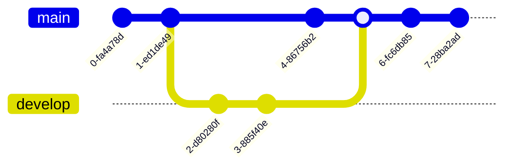

# UNIVERSIDAD COOPERATIVA DE COLOMBIA

# PROGRAMA DE INGENIERÍA DE SISTEMAS

# DOCUMENTO PROYECTOS DE AULA

# Cerberus: gestión de esquemas de seguridad para fuerzas militares

Docente Acesor: Ing. Carlos Ignacio Torres

Erick Andrés Báez Cruz

Daniel Quintero Céspedes

Curso: Programación Orientada a Objetos

2022

## TABLA DE CONTENIDO

1. [Introducción](#intro)
2. [Planteamiento del problema](#planteamiento_problema)
   1. [Objetivos](#objetivos)
      1. [Objetivo general](#planteamiento_problema)
      2. [Objetivos específicos](#objetivos_especificos)
   2. [Justificación](#justificacion)
3. [Marco de referencia](#marco_referencia)
   1. [Marco contextual](#marco_contextual)
   2. [Marco teórico](#marco_teorico)
   3. [Marco legal](#marco_legal)
4. [Metodología ingenieril](#metodologia_ingenieril)
5. [Desarrollo ingenieril](#4-desarrollo_ingenieril)
   1. [Requerimientos](#requerimientos)
      1. [Requerimientos funcionales](#requerimientos_funcionales)
      2. [Requerimientos no funcionales](#requerimientos_nofuncionales)
      3. [Requerimientos de facilidad de uso](#requerimientos_facilidaduso)
   2. [Modelado](#modelado)
      1. [Diagrama de clases](#diagrama_clases)
      2. [Diagrama de casos de uso](#diagrama_casosuso)
      3. [Diagrama de entidad relación](#diagrama_er)
6. [Análisis económico](#analisis_economico)
7. [Bibliografía](#bibliografia)
8. [Anexos](#anexos)

- LISTAS ESPECIALES
- LISTA DE TABLAS
- LISTA DE FIGURAS
- LISTA DE ANEXOS

## INTRODUCCIÓN

La seguridad en las instalaciones dentro del ámbito militar, es un tema ámplio y complejo, debido a la importancia que representa el personal militar, sus equipamientos y funciones asociadas a estos, dentro o al rededor de una infraestructura en particular. Es por esto, que los esquemas de seguridad representan una importancia relevante dentro de la planeación y/o ejecución de planes de acción que garantizen la total seguridad de éstas instalaciones frente a ataques de grupos delincuenciales al margen de la ley, que busquen vulnerar y/o violentar físicamente un establecimiento militar en específico.

Es por esto, que en el presente documento se tiene la intención de abordar el diseño y construcción de un sistema de información web llamada Ceberus, el cual, está enfocado a la gestión de esquemas de seguridad en fuerzas militares, el cual, facilite a los altos mandos gestionar las posiciones del personal en función a estadísticas individuales obtenidas en polígonos y cursos realizados. Es decir, se prioriza planteamiento de modelos de seguridad sólidos en base a estadísticas tomadas y procesadas por un algoritmo de inteligencia y visión artificial que reciba como entrada, fotografías de los objetivos usados en prácticas de polígono realizadas por parte de los militares, facilitando de esta manera, la elección del personal en relación a sus aptitudes y un respectivo seguimiento individual y grupal del progreso del batallón.

## ABSTRACT

This document intends to address the design and construction of a web information system focused on the management of security schemes in military forces, which makes it easier for high command to manage personnel positions based on individual statistics obtained in polygons and courses carried out. Thus facilitating decision-making within military installations and optimizing the use of personnel.

## 1. PLANTEAMIENTO DEL PROBLEMA

Las fuerzas militares alrededor del mundo, poseen mútliples necesidades en cuanto a innovación de hardware, software, ciencia de datos, aprendizaje automático e inteligencia aritificial que ayuden a impulsar y/o optimizar sus acciones frente a grupos al margen de la ley presentes en el territorio en el cual se desempeñen. De forma general, se tiene existen aproximadamente 18'000.000 (dieciocho millones) de uniformados activos en el mundo, en donde cada país tiene un estimado de 4 fuerzas militares y respectivamente un promedio de 20 instalaciones conocidas que se encuentran asociadas a cada una de estas fuerzas militares. Hay que tener en cuenta que sus infractestructuras y equipamientos cambian considerablemente en función a los recursos económicos que posea el país en que se encuentra la fuerza militar y el dinero destinado a estos.

Por tanto, se encuentra una necesidad de diseñar e implementar un sistema capaz de apoyar en la toma de desiciones a los altos mandos de cada fuerza militar y sus ramas con respecto a que militares pueden ser posicionados en un lugar en específico dentro de la instalación militar, buscando de esta manera, un sólido esquema de seguridad, óptimo y con una alta capacidad de respuesta frente a cualquier tipo de eventualidad que pueda ocurrir.

### 1.1 DESCRIPCION DEL PROBLEMA

La gestión de personal y asignación de posiciones dentro de una instalación militar, se realiza por parte de altos mandos o quien se encuentre a cargo. Sin embargo, en la mayoria de situaciones no se tienen en consideración algunos puntos estrategicos que pueden haber dentro de la base militar o las aptitudes que tiene cada soldado, las cuales pueden ser fundamentales al momento de enfrentar una situación de hostigamiento por parte de grupos al margen de la ley u otro tipo de eventualidades no comunes.

### 1.2 OBJETIVOS

### 1.2.1 OBJETIVO GENERAL

Construir un sistema de información web que sirva como herramienta a las fuerzas militares para la toma de desiciones en la planeación e integración de esquemas de seguridad en sus bases. En donde la gestión y asignación de posiciones al personal militar pueda ser algo completamente dependiente de las de las aptitudes de un soldado en particular.

### 1.2.2 OBJETIVOS ESPECÍFICOS

1. Identificar las principales necesidades y/o vulnerabilidades que puedan tener las fuerzas militares en el mundo en relación a esquemas de seguridad y de protección en sus instalaciones.
2. Diseñar interfaces intuitivas y minimalistas que permitan visualizar información de manera clara y concisa. En donde el usuario pueda disponer de una amplia gama de opciones sin afectar su experencia en el uso del sistema.
3. Implementar inteligencia artifcial, buenas prácticas de desarrollo de software y seguridad para garantizar la estabilidad y escalabilidad del sistema.

### 1.3 JUSTIFICACIÓN

La importancia de este proyecto se ve reflejada en el contexto en que se desarrolla, ya que es un campo en el cual no se tienen muchos antecedentes de proyectos enfocados a este. Sumado a ello, se está proporcionando una aplicabilidad del producto a cualquier tipo de fuerza militar perteneciente a algún país en concreto. También es de suma importancia la gestion por parte de los altos mandos de las estadisticas de las tropas y/o uniformados que poseen en el personal en ese momento, para que posteriormente, sean distribuidas optimamente en función a sus capacidades demostradas en prácticas de polígonos históricas realizadas desde su inclusión en la fuerza militar.

Por tanto, este proyecto puede tener un impacto significante y aporte dentro de las fuerzas militares, ciudadania y mitigación de ataques de grupos al margen de la ley, teniendo la oportunidad de plantear esquemas de seguridad solidos con alta capidad de respuesta que pueda dar uso de todos los implementos, armas y demás objetos dispuestos dentro de la instalación milita para brindar la seguridad total de batallón y/o brigada, y sus alrededores.

## 2 MARCO DE REFERENCIA

### 2.1 MARCO CONTEXTUAL (Antecedentes y Diagnóstico tecnológico actual de la empresa )

Actualmente, no se tienen presentes antecedentes conocidos sobre la implementación de software de esquemas de seguridad o parecidos dentro de fuerzas militares. Lo anterior, puede producirse debido a la confidencialidad y seguridad de la información de los uniformados e instalaciones asociadas a uan fuerza militar en particular.

Las fuerzas militares en el mundo, poseen en su mayoria un amplio espectro tecnológico, ya se por parte de alianzas con otro países o financiaciones por parte del gobierno en que se encuentran. En donde se encuentra tecnología de punta enfocada a cada razgo importante y/o característico que pueda tener dicha fuerza militar.

### 2.2 MARCO TEORICO

### 2.3 MARCO LEGAL

Ley 603 de 2000 (Ley de licencias de software). Esta ley se centra en exigir a las empresas un reporte fiel referente a la evolución y/o situación jurídico-administrativa actual de la empresa. Dentro de este informe se debe evidenciar el cumplimiento que tenga el negocio en cuanto a las normas de derechos de autor, esto se realiza con el fin de reducir los índices de piratería en le territorio colombiano. También, esta ley da el poder de verificar que las empresas no estén evadiendo ningún tipo de impuesto mediante la violación de la propiedad intelectual (derechos de autor), ya que el software se contempla como un activo intangible en donde se debe realizar el pago de renta y/o tributo. El incumplimiento de esta normativa puede acarrear sanciones monetarias que alcancen los 200 salarios mínimos legales vigentes o responsabilidad penal. Esta ley se relaciona directa e indirectamente con:

Decreto 1360 de 1989 (Por el cual se reglamenta la inscripción del software en el Registro Nacional del Derecho). Dentro de este decreto se establece que el software (soporte lógico) es una obra inédita propia del dominio literario, por tanto, su protección se fundamenta bajo los derechos de autor. Para el registro del software se debe realizar una solicitud a el Registro Nacional del Derecho.

Ley 23 de 1982 (Sobre derechos de autor). En esta ley se establece que aquellos autores de obras literarias, artísticas y/o científicas (software), van a gozar de la respectiva protección de sus obras dentro de los limites que se contemplen. De la misma manera esta ley cobija a sus creadores o ejecutantes dentro de sus derechos como autores.

## 3. METODOLOGIA INGENIERIL

La metodología ingenieril usada para el desarrollo de Cerberus es SCRUM, la cual, facilita en mayor medida la organización de los equipos de trabajo, sus tareas a realizar, tiempos a cumplir, definición de responsabilidades, etc. Es por esto, que SCRUM fue la metología que se implementó, debido a su versatibilidad para aplicarse dentro de cualquier equipo de desarrollo y facilidad de comprensión mediante los artefactos que ofrece.

El manejo de algunos de los artefactos que sugiere la metodología de desarrollo ágil SCRUM se realizaron mediante Trello: https://trello.com/b/O5suX0KM/cerberus

Por otra parte, en cuanto al flujo de trabajo manejado dentro del repositio GitHub, el cual aloja todo el código fuente de este software, se basa en el trabajo por ramas para proporcionar un feedback solido dentro de la rama principal (main), en donde se envía el código escencial o aprobrado por parte del desarrollador front y back.

## 4. DESARROLLO INGENIERIL

### 4.1 REQUERIMIENTOS

#### Requerimientos funcionales

1. Inicio de sesión con niveles de acceso.
2. Registro de personal militar en función al batallón que pertenezcan.
3. Lectura, almacenamiento y visualización de planos.
4. Planteamiento de esquemas de seguridad con base a los planos ingresados.
5. Asignación de posición en el modelo de seguridad a los militares.
6. Asignación de armamento a los uniformados que pertenezcan al esquema de protección, identificando el serial de estas.
7. Consultar esquemas previamente planteados.
8. Almacenamiento de esquemas de seguridad previamente realizados.
9. Identificar impactos efectivos a los objetivos del polígono.
10. Registro de prácticas de polígono por parte de altos mandos.
11. Análisis estadístico individual de la práctica de polígono realizada.
12. Análisis estadístico general de la práctica de polígono realizada.
13. Visualización de estadísticas generales en función a los polígonos realizados por el uniformado.
14. Extracción de noticias relacionadas a seguridad a través de Web Scrapping a la página del CNN.

#### Requerimientos no funcionales

1. Atomicidad al consultar datos.
2. Validación de formularios.
3. Verificación recaptcha v3.

#### Requirimientos de facilidad de uso

1. Interfaz sencilla y amigable con el usuario.
2. Paleta de colores que posean un excelente contraste.
3. Sugerencias al usuario sobre el uso del sistema.

### 4.2 MODELADO

#### Diagrama de casos de uso

#### Diagrama de clases

#### Diagrama de entidad relación

### 4.3 DESCRIPCIÓN TÉCNICA DEL SISTEMA

Cerberus es un software web desarrollo en el lenguaje de programación python y su framework web Django en el entorno de desarrollo Visual Studio Code. Consta de una base de datos relacional MySQL. También, usa las principales librerias de ciencia de datos y visión artificial como lo son: OpenCV, Pandas, Skimage, Numpy. Por otra parte, se implementan librerias de WebScrapping y peticiones a una página web para la extracción de información de un sitio, en donde se usa: BeatifulSoup, Selenium, requests, etc.

### 4.4 DISEÑO INTERFAZ

Diseño de interfaz de landing page:

Diseño de interfaz de contacto en landing page:

Diseño de interfaz del login:

Diseño de interfaz de pagina principal de Cerberus:

Diseño de interfaz de sección de perfil:

Diseño de interfaz de la secciónd de personal en la inslación:

Diseño de interfaz de practicas personales de poligono realizadas:

Diseño de interfaz de creación de esquema de seguridad:

## 5. ANÁLISIS ECONÓMICO (Hasta donde se haya desarrollado el proyecto)

## 6. CONCLUSIONES Y RECOMENDACIONES (Para proyectos desarrollados)

## 7. BIBLIOGRAFIA

## ANEXOS (Documentación complementaria
