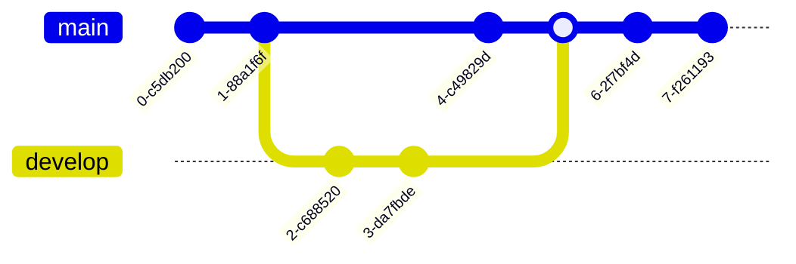

# UNIVERSIDAD COOPERATIVA DE COLOMBIA

# PROGRAMA DE INGENIERÍA DE SISTEMAS

# DOCUMENTO PROYECTOS DE AULA

# Cerberus: gestión de esquemas de seguridad para fuerzas militares

Erick Andrés Báez Cruz

Daniel Quintero Céspedes

Docente Acesor: Ing. Carlos Ignacio Torres

Curso: Programación Orientada a Objetos

2022

## TABLA DE CONTENIDO

1. [Introducción](#intro)
2. [Planteamiento del problema](#planteamiento_problema)
   1. [Objetivos](#objetivos)
      1. [Objetivo general](#objetivo_general)
      2. [Objetivos específicos](#objetivos_especificos)
   2. [Justificación](#justificacion)
3. [Marco de referencia](#marco_referencia)
   1. [Marco contextual](#marco_contextual)
   2. [Marco teórico](#marco_teorico)
   3. [Marco legal](#marco_legal)
4. [Metodología ingenieril](#metodologia_ingenieril)
5. [Desarrollo ingenieril](#4-desarrollo_ingenieril)
   1. [Requerimientos](#requerimientos)
      1. [Requerimientos funcionales](#requerimientos_funcionales)
      2. [Requerimientos no funcionales](#requerimientos_nofuncionales)
      3. [Requerimientos de facilidad de uso](#requerimientos_facilidaduso)
   2. [Modelado](#modelado)
      1. [Diagrama de clases](#diagrama_clases)
      2. [Diagrama de casos de uso](#diagrama_casosuso)
      3. [Diagrama de entidad relación](#diagrama_er)
6. [Descripcion Técnica del sistema](#descripcion_tecnica)
7. [Diseño interfaz](#diseño_interfaz)
8. [Análisis económico](#analisis_economico)
9. [Conclusiones y recomendaciones](#conclusiones)
10. [Bibliografía](#bibliografia)

- LISTA DE FIGURAS
1. [Metodología srcum](#scrum)
2. [Diagrama de casos de uso](#diagrama_casosuso)
3. [Diagrama de clases](#diagrama_clases)
4. [Diagrama de entidad relación](#diagrama_er)
5. [Opencv](#opencv)
6. [Django](#django)
7. [Diseño de interfaz: Landing page](#interfaz_landing)
8. [Diseño de interfaz: Contacto](#interfaz_contacto)
9. [Diseño de interfaz: Login](#interfaz_login)
10. [Diseño de interfaz: Cerberus](#interfaz_cerberus)
11. [Diseño de interfaz: Perfil](#interfaz_perfil)
12. [Diseño de interfaz: Personal](#interfaz_personal)
13. [Diseño de interfaz: Prácticas de polígono](#interfaz_poligono)
14. [Diseño de interfaz: Esquemas de seguridad](#interfaz_esquemas)

- LISTA DE TABLAS
1. [Tabla de análisis económico](#tabla_analisis_economico)

## INTRODUCCIÓN

La seguridad en las instalaciones dentro del ámbito militar, es un tema ámplio y complejo, debido a la importancia que representa el personal militar, sus equipamientos y funciones asociadas a estos, dentro o al rededor de una infraestructura en particular. Es por esto, que los esquemas de seguridad representan una importancia relevante dentro de la planeación y/o ejecución de planes de acción que garantizen la total seguridad de éstas instalaciones frente a ataques de grupos delincuenciales al margen de la ley, que busquen vulnerar y/o violentar físicamente un establecimiento militar en específico.

Es por esto, que en el presente documento se tiene la intención de abordar el diseño y construcción de un sistema de información web llamada Ceberus, el cual, está enfocado a la gestión de esquemas de seguridad en fuerzas militares, el cual, facilite a los altos mandos gestionar las posiciones del personal en función a estadísticas individuales obtenidas en polígonos y cursos realizados. Es decir, se prioriza planteamiento de modelos de seguridad sólidos en base a estadísticas tomadas y procesadas por un algoritmo de inteligencia y visión artificial que reciba como entrada, fotografías de los objetivos usados en prácticas de polígono realizadas por parte de los militares, facilitando de esta manera, la elección del personal en relación a sus aptitudes y un respectivo seguimiento individual y grupal del progreso del batallón.

## RESUMEN

Este documento pretende abordar el diseño y construcción de un sistema de información web enfocado a la gestión de esquemas de seguridad en las fuerzas militares, el cual que facilite a los altos mandos la gestión de puestos de personal en base a estadísticas individuales obtenidas en polígonos y cursos realizados. Facilitando así, la toma de decisiones dentro de las instalaciones militares y optimizando el uso del personal. Este producto presenta una alta relevancia debido a la factibilidad que existe el originar un software enfocado a este nicho de mercado poco tratado dento de la industria del desarrollo de software.

## ABSTRACT

This document aims to address the design and construction of a web information system focused on the management of security schemes in the military forces, which facilitates the management of personnel positions based on individual statistics obtained in polygons and courses taken. Thus facilitating decision-making within military installations and optimizing the use of personnel. This product is highly relevant due to the feasibility of creating software focused on this little-treated market niche within the software development industry.

## 1. PLANTEAMIENTO DEL PROBLEMA

Las fuerzas militares alrededor del mundo, poseen mútliples necesidades en cuanto a innovación de hardware, software, ciencia de datos, aprendizaje automático e inteligencia aritificial que ayuden a impulsar y/o optimizar sus acciones frente a grupos al margen de la ley presentes en el territorio en el cual se desempeñen. De forma general, se tiene existen aproximadamente 18'000.000 (dieciocho millones) de uniformados activos en el mundo, en donde cada país tiene un estimado de 4 fuerzas militares y respectivamente un promedio de 20 instalaciones conocidas que se encuentran asociadas a cada una de estas fuerzas militares. Hay que tener en cuenta que sus infractestructuras y equipamientos cambian considerablemente en función a los recursos económicos que posea el país en que se encuentra la fuerza militar y el dinero destinado a estos.

Por tanto, se encuentra una necesidad de diseñar e implementar un sistema capaz de apoyar en la toma de desiciones a los altos mandos de cada fuerza militar y sus ramas con respecto a que militares pueden ser posicionados en un lugar en específico dentro de la instalación militar, buscando de esta manera, un sólido esquema de seguridad, óptimo y con una alta capacidad de respuesta frente a cualquier tipo de eventualidad que pueda ocurrir.

### 1.1 DESCRIPCION DEL PROBLEMA

La gestión de personal y asignación de posiciones dentro de una instalación militar, se realiza por parte de altos mandos o quien se encuentre a cargo. Sin embargo, en la mayoria de situaciones no se tienen en consideración algunos puntos estrategicos que pueden haber dentro de la base militar o las aptitudes que tiene cada soldado, las cuales pueden ser fundamentales al momento de enfrentar una situación de hostigamiento por parte de grupos al margen de la ley u otro tipo de eventualidades no comunes que pongan a prueba la solidez del esquema de seguridad contemplado en la instalación militar en donde se presenta.

### 1.2 OBJETIVOS

### 1.2.1 OBJETIVO GENERAL

Construir un sistema de información web que sirva como herramienta a las fuerzas militares para la toma de desiciones en la planeación e integración de esquemas de seguridad en sus bases y/o instalaciones militares. En donde la gestión y asignación de posiciones al personal militar pueda ser un factor determinante en función de las de las aptitudes de un uniformado en particular.

### 1.2.2 OBJETIVOS ESPECÍFICOS

1. Identificar las principales necesidades y/o vulnerabilidades que puedan tener las fuerzas militares en el mundo en relación a esquemas de seguridad y de protección en sus instalaciones.
2. Diseñar interfaces intuitivas y minimalistas que permitan visualizar información de manera clara y concisa. En donde el usuario pueda disponer de una amplia gama de opciones sin afectar su experencia en el uso dentro del sistema.
3. Implementar fundamentos de la inteligencia artifcial, ciencia de datos, buenas prácticas de desarrollo de software y seguridad para garantizar la estabilidad y escalabilidad del sistema con base a las funcionalidades que brinda.

### 1.3 JUSTIFICACIÓN

La importancia de este proyecto se ve reflejada en el contexto en que se desarrolla, ya que es un campo en el cual no se tienen muchos antecedentes de proyectos enfocados a este. Sumado a ello, se está proporcionando una aplicabilidad del producto a cualquier tipo de fuerza militar perteneciente a algún país en concreto. También es de suma importancia la gestion por parte de los altos mandos de las estadisticas de las tropas y/o uniformados que poseen en el personal en ese momento, para que posteriormente, sean distribuidas optimamente en función a sus capacidades demostradas en prácticas de polígonos históricas realizadas desde su inclusión en la fuerza militar.

Por tanto, este proyecto puede tener un impacto significante y aporte dentro de las fuerzas militares, ciudadania y mitigación de ataques de grupos al margen de la ley, teniendo la oportunidad de plantear esquemas de seguridad solidos con alta capidad de respuesta que pueda dar uso de todos los implementos, armas y demás objetos dispuestos dentro de la instalación milita para brindar la seguridad total de batallón y/o brigada, y sus alrededores.

## 2 MARCO DE REFERENCIA

### 2.1 MARCO CONTEXTUAL

Actualmente, no se tienen presentes antecedentes conocidos sobre la implementación de software de esquemas de seguridad o parecidos dentro de fuerzas militares. Lo anterior, puede producirse debido a la confidencialidad y seguridad de la información de los uniformados e instalaciones asociadas a una fuerza militar en particular. Sin embargo, se pueden identificar algunos proyectos de empresas que realizan trabajos de software y/o hardware en conjunto con algunas fuerzas militares del mundo, en donde se puede encontrar:

VACIS Non-Intrusive X-Ray Inspection Systems: Se encarga de escanear camiones y vehículos con el fin de brindar soporte a las autoridades con la busqueda de estupefacientes, armas, material nuclear y otros tipos de contrabando.

Silent Archer: Tecnología enfocada en el trastreo, clasificación de amenazas aereas no tripuladas (drones). En donde, se implementa un radar y pantalla para el usuario en 3D, donde se puede llevar a cabo la inhabilitación de comunicaciones con el operador del dron y él mismo.

Es decir, que las fuerzas militares en el mundo, poseen en su mayoria un amplio espectro tecnológico, ya se por parte de alianzas con otro países o financiaciones por parte del gobierno en que se encuentran. En donde se encuentra tecnología de punta enfocada a cada razgo importante y/o característico que pueda tener dicha fuerza militar.

### 2.2 MARCO TEORICO

Con el paso del tiempo, las fuerzas militares en el mundo han sufrido una amplia gama de cambios y variaciones en cuanto a innovaciones tecnológicas (tanto hardware como software) de acuerdo a las necesidades que se presenten en cuanto al control, protección y seguridad de la nación o una instalación militar en particular que desee ser salvo guardada de actividad hostíl, atentados, hostigamientos o disturbios. Lo anterior se da a lugar de acuerdo con el entorno, inversión e innovación en equipamientos que presente la fuerza militar, ya que el combate por la mitigación de los impactos por parte de grupos al margen de la ley, es una tarea de demanda equipos de tecnología de punta y así mismo, sistemas de información que sirvan como apoyo para la toma de desiciones en función al personal que se dispongan y sus respectivas características. De a cuerdo con Espitia Cubillos (2020) : "La revolución tecnológica militar ha llevado a la creación de nuevos modelos de operación,impulsando el éxito de las estrategias, seguridad y defensa". Es decir, que los avances tecnológicos por parte de aliados de la fuerzas militares o mienbros de estos mismo, han hecho posible el desarrollo impulsado de factores de éxito en temas de seguridad y defensa.

De a cuerdo con Germán Padinger (Miembro del DCC), dentro de las fuerzas militares más poderosas del mundo contemplatadas en la OTAN (Organización del Tratado del Atlántico Norte) se encuentran: Estados Unidos, Rusia, China y Índia, Japón, Corea del Sur, Francia, Reino unido, entre otros. Padinger, G. (2022, 15 noviembre). Los cuales poseen un amplio presupuesto e inversiones en tecnología militar, inteligencia, blinje y refuerzo a bases militares, etc. Cada fuerza militar en el mundo tiene un orden organizacional jerárquico por rangos o grados, en donde el alcance o reelevancia de sus desiciones están dados respecto a estos. Es decir, que a mayor rango se evidencia una mayor responsabilidad en cuanto al espectro de desiciones que deben ser tomadas a lo largo del tiempo en que el uniformado esta ligado a una fuerza militar en concreto.

Por otra parte, los esquemas de seguridad pueden considerarse como modelos conformados por profesionales que tienen las aptitudes técnicas y tácticas para llevar a cabo actividades de protección y seguridad brindada a un PMI (Persona muy importante) o todo aquello que se encuentra dentro de una instalación, complejo, etc. Las características que poseen estos esquemas de protección es que el trabajo en equipo representa un factor de éxito para estos, ya que brindan junto con la comunicación efectiva, un mecanísmo de respuesta frente a ventualidades que se puedan presentar, dando mayor solidez al esquema de seguridad y todos sus integrantes. De a cuerdo con Suarez Quiñones L:

"[...] el trabajo realizado por los funcionarios de
protección cubre espacios o responsabilidades que en la mayoría de casos la fuerza pública de cada
país no puede cumplir y al tratarse de proteger vidas y bienes la capacitación de estas personas
tendrá ciertos estándares de calidad [..]". (2020) Suarez Quiñones L.

Por tal motivo, los esquemas de protección cobijan un amplio espectro de situaciones de riesgo que pueden ser mitigados por estos mismos, siempre y cuando se cumplir a cabalidad con las principales caracterististicas que debe tener un esquema de seguridad para que su capacidad de respuesta sea la mejor, y más, en un entorno como lo puede ser una instalación militar, en donde se está en una constante necesidad de observación y control de lo que sucede dentro y fuera de estas.

### 2.3 MARCO LEGAL

Ley 603 de 2000 (Ley de licencias de software). Esta ley se centra en exigir a las empresas un reporte fiel referente a la evolución y/o situación jurídico-administrativa actual de la empresa. Dentro de este informe se debe evidenciar el cumplimiento que tenga el negocio en cuanto a las normas de derechos de autor, esto se realiza con el fin de reducir los índices de piratería en le territorio colombiano. También, esta ley da el poder de verificar que las empresas no estén evadiendo ningún tipo de impuesto mediante la violación de la propiedad intelectual (derechos de autor), ya que el software se contempla como un activo intangible en donde se debe realizar el pago de renta y/o tributo. El incumplimiento de esta normativa puede acarrear sanciones monetarias que alcancen los 200 salarios mínimos legales vigentes o responsabilidad penal. Esta ley se relaciona directa e indirectamente con:

Decreto 1360 de 1989 (Por el cual se reglamenta la inscripción del software en el Registro Nacional del Derecho). Dentro de este decreto se establece que el software (soporte lógico) es una obra inédita propia del dominio literario, por tanto, su protección se fundamenta bajo los derechos de autor. Para el registro del software se debe realizar una solicitud a el Registro Nacional del Derecho.

Ley 23 de 1982 (Sobre derechos de autor). En esta ley se establece que aquellos autores de obras literarias, artísticas y/o científicas (software), van a gozar de la respectiva protección de sus obras dentro de los limites que se contemplen. De la misma manera esta ley cobija a sus creadores o ejecutantes dentro de sus derechos como autores.

Ley 1581 de 2012 (Ley de Protección de Datos Personales). Se protege y reconoce el derecho que tienen todas las personas a tener en conocimiento, oportunidad de actualizar y/o rectificar los datos personales que hayan sido recopiladas en bases de datos por parte de empresas públicas o privadas.

Ley 1862 de 2017 (Normas de conducta del militar colombiano): Se establecen los compotamientos y normas que le competen a los uniformados pertenecientes a fuerzas militares en Colombiano,

## 3. METODOLOGIA INGENIERIL

La metodología ingenieril usada para el desarrollo de Cerberus es SCRUM, la cual, facilita en mayor medida la organización de los equipos de trabajo, sus tareas a realizar, tiempos a cumplir, definición de responsabilidades, etc. Es por esto, que SCRUM fue la metología que se implementó, debido a su versatibilidad para aplicarse dentro de cualquier equipo de desarrollo y facilidad de comprensión mediante los artefactos que ofrece.

El manejo de algunos de los artefactos que sugiere la metodología de desarrollo ágil SCRUM se realizaron mediante Trello: https://trello.com/b/O5suX0KM/cerberus

Por otra parte, en cuanto al flujo de trabajo manejado dentro del repositio GitHub, el cual aloja todo el código fuente de este software, se basa en el trabajo por ramas para proporcionar un feedback solido dentro de la rama principal (main), en donde se envía el código escencial o aprobrado por parte del desarrollador front y back.

## 4. DESARROLLO INGENIERIL

### 4.1 REQUERIMIENTOS

#### Requerimientos funcionales

1. Inicio de sesión.
2. Registro información en funcón a la instalación a la que pertenezca.
3. Lectura, almacenamiento y visualización de planos.
4. Planteamiento de esquemas de seguridad.
5. Asignación de posición en el modelo de seguridad a los militares.
6. Asignación de armamento a los uniformados que pertenezcan al esquema de protección.
7. Consultar esquemas previamente planteados.
10. Registro de prácticas de polígono por parte de altos mandos.
11. Consultar estadísticas

#### Requerimientos no funcionales

1. Atomicidad al consultar datos.
2. Validación de formularios.
3. Verificación recaptcha v3.
4. Niveles de acceso en login.
6. Identificar impactos efectivos a los objetivos del polígono por parte de la I.A
7. Análisis estadístico general de la práctica de polígono realizada.
8. Análisis estadístico individual de la práctica de polígono realizada.
9. Extracción de noticias relacionadas a seguridad a través de Web Scrapping a la página del CNN.

#### Requirimientos de facilidad de uso

1. Interfaz sencilla y amigable con el usuario.
2. Paleta de colores que posean un excelente contraste.
3. Sugerencias al usuario sobre el uso del sistema.
4. Arrastrar y soltar militar al esquema de seguridad.
5. Recaptcha v3, el cual no necesite una verificación y afectar la experencia de usuario.

### 4.2 MODELADO

#### Diagrama de casos de uso

#### Diagrama de clases

#### Diagrama de entidad relación

### 4.3 DESCRIPCIÓN TÉCNICA DEL SISTEMA

Cerberus es un software web desarrollo en el lenguaje de programación python y su framework web Django en el entorno de desarrollo Visual Studio Code. Consta de una base de datos relacional MySQL. También, usa las principales librerias de ciencia de datos y visión artificial como lo son: OpenCV, Pandas, Skimage, Numpy. Por otra parte, se implementan librerias de WebScrapping y peticiones a una página web para la extracción de información de un sitio, en donde se usa: BeatifulSoup, Selenium, requests, etc.

### 4.4 DISEÑO INTERFAZ

Diseño de interfaz de landing page:

Diseño de interfaz de contacto en landing page:

Diseño de interfaz del login:

Diseño de interfaz de pagina principal de Cerberus:

Diseño de interfaz de sección de perfil:

Diseño de interfaz de la secciónd de personal en la inslación:

Diseño de interfaz de practicas personales de poligono realizadas:

Diseño de interfaz de creación de esquema de seguridad:

## 5. ANÁLISIS ECONÓMICO

| Factor     | Costo         |
| ---------- | ------------- |
| Desarrollo | $40.800.000   |
| Hosting    | $400.000  |
| Mantenimiento | $3.000.000  |
| Total | $478.00.000  |

## 6. CONCLUSIONES Y RECOMENDACIONES
Se puede concluir, que cerberus es un software que abarca un nicho de mercado muy poco abordardo por el desarrollo del software con el paso del tiempo (hasta lo que se conoce debido a la confidencialidad de la información), permitiendo la oportunidad de suplir una necesidad de organización de tropas y/o uniformados en puestos establecidos. Es un software ambicioso debido a la magnitud de personal que se tiene por fuerza militar.

## 7. BIBLIOGRAFÍA

VACIS Non-Intrusive X-Ray Inspection Systems. (s. f.). Leidos. https://www.leidos.com/products/vacis

OpenSystems Media. (s. f.). Silent Archer Counter-UAS Technology - Military Embedded Systems. https://militaryembedded.com/unmanned/counter-uas/silent-archer-counter-uas-technology

Ley 1862 de 2017, por la cual se establecen las normas de conducta del Militar Colombiano y se expide el Código Disciplinario Militar, https://vlex.com.co/vid/ley-1862-2017-establecen-691489457.

Ley 603 de 2000 - Gestor Normativo. (2015, 1 diciembre). Funcion Publica. https://www.funcionpublica.gov.co/eva/gestornormativo/norma.php?i=13960

Espitia Cubillos, Anny Astrid, Agudelo Calderón, Jairo Andrés, & Buitrago Suescún, Óscar Yecid. (2020). Innovaciones tecnológicas en las fuerzas militares de los países del mundo: una revisión preliminar. Revista Científica General José María Córdova, 18(29), 213-235. Epub August 28, 2020. https://doi.org/10.21830/19006586.537

Padinger, G. (2022, 15 noviembre). El poder militar de la OTAN: ¿cuáles son los miembros más fuertes de la Alianza Atlántica? CNN. https://cnnespanol.cnn.com/2022/11/15/poderio-militar-otan-orix/

Suarez Quiñones, L. C. (202d. C., septiembre 15). Identificación de Riesgos en Esquemas de Protección en Latinoamérica. Unimilitar. https://repository.unimilitar.edu.co/bitstream/handle/10654/37884/suarezqui%C3%B1onezluiscarlos2021.pdf.pdf?sequence=1&isAllowed=y#:~:text=Los%20esquemas%20de%20la%20seguridad,el%20esquema%20de%20seguridad%20controla

